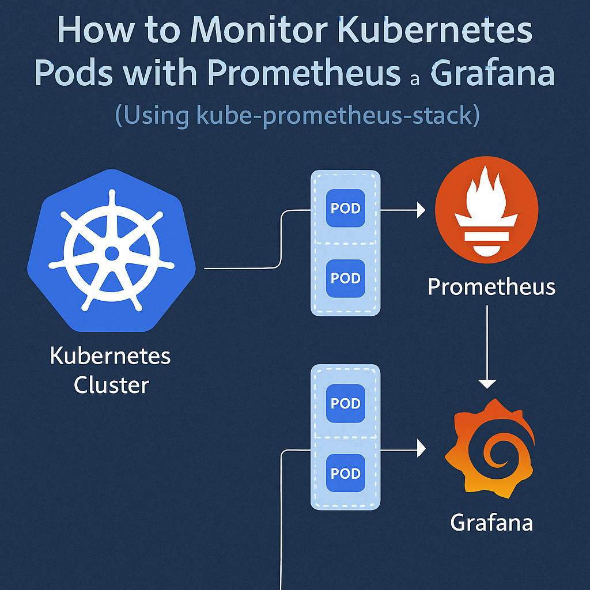
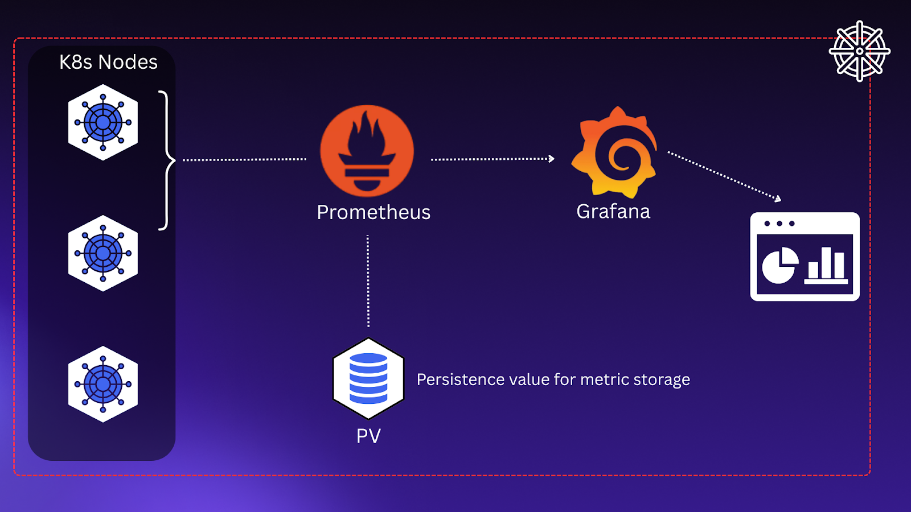

# Monitoring Stack

Monitoring Stack (Kubernetes + Prometheus + Grafana)

A production-style DevOps project demonstrating Kubernetes monitoring using Prometheus for metrics collection and Grafana for visualization.

# Project Overview
 
Monitoring is a critical component of modern DevOps and production systems.

This project sets up a complete monitoring stack inside a Kubernetes cluster where:

      Prometheus collects metrics from the cluster
      Grafana visualizes metrics using dashboards

# Architecture

      User (Browser)
            ↓
      Grafana (Visualization Layer)
            ↓
      Prometheus (Metrics Collection)
            ↓
      Node Exporter (metrics source)
            ↓
      Kubernetes Cluster (Pods & Nodes)

Project Structure
devops-monitoring-stack/ 
 ├── monitoring/ 
 │    ├── prometheus.yaml 
 │    ├── grafana.yaml 
 │    └── node-exporter.yaml 
 └── README.md

# Tools Used

Container Orchestration

      • Kubernetes

Monitoring & Metrics Collection

      • Prometheus

Visualization Dashboard

      • Grafana

Local Kubernetes Cluster

      • Minikube

# Monitoring Workflow

      • Prometheus scrapes metrics from Kubernetes workloads
      • Metrics are stored in the Prometheus database as time-series data
      • Grafana reads metrics from Prometheus
      • Dashboards visualize system performance

# Metrics Monitored

Examples include:

      • CPU usage
      • Memory usage
      • Pod status
      • Node health
      • Cluster performance

# Deployment Workflow

Start Cluster

      minikube start
      kubectl get nodes
      kubectl get pods

Deploy Node Exporter

      kubectl apply -f node-exporter.yaml

Deploy Prometheus

      kubectl apply -f prometheus.yaml

Deploy Grafana
      
      kubectl apply -f grafana.yaml

Verify Resources
      
      kubectl get pods
      kubectl get services

Access Services
      
      minikube service prometheus
      minikube service grafana

# Grafana Setup

Default credentials:

      Username: admin
      Password: admin

Add Prometheus Data Source

      URL: http://prometheus:9090

# Import Dashboard

Import dashboard using ID:

      1860

# Cleanup

      minikube delete

# What This Project Demonstrates

      • Kubernetes monitoring fundamentals
      • Metrics collection using Prometheus
      • Visualization using Grafana
      • Observability in DevOps

# Future Improvements

      • Add Alertmanager for alerts
      • Configure Slack/Email notifications
      • Monitor application-level metrics
      • Deploy on cloud Kubernetes (EKS/GKE)

# Screenshots

Start Cluster
 

Deploy Prometheus

Deploy Grafana

Apply Node Exporter

Verify Resources

Access Services

Prometheus targets (UP)

Node Query on Prometheus

Grafana Setup

 
# Dashboard Setup

Prometheus as Data Source

 
Import Dashboad with ID=1860

Dashboard Metrics

Dashboard Graphs

# Cleanup

Delete Cluster

